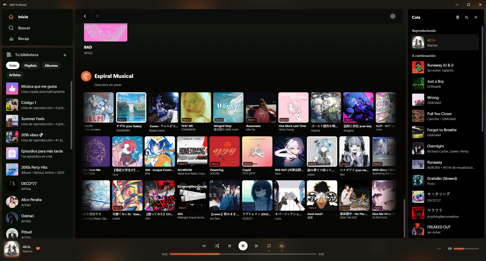
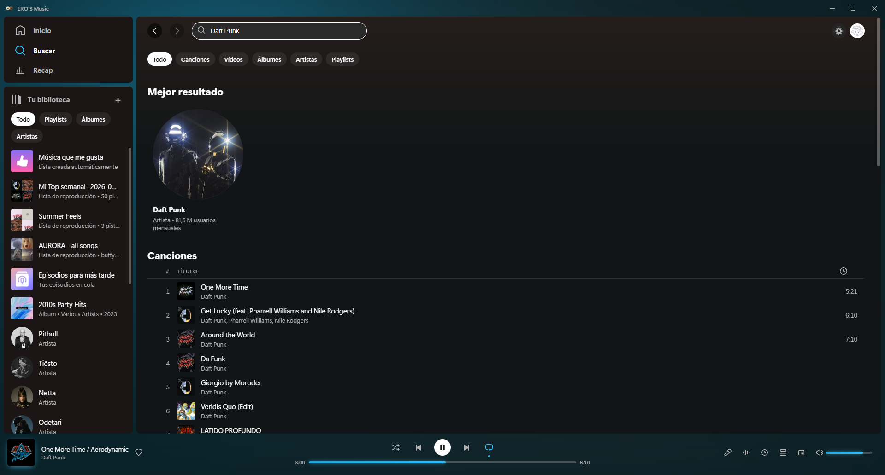
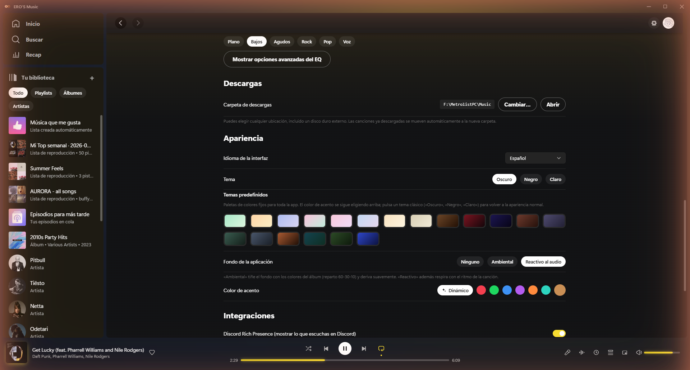
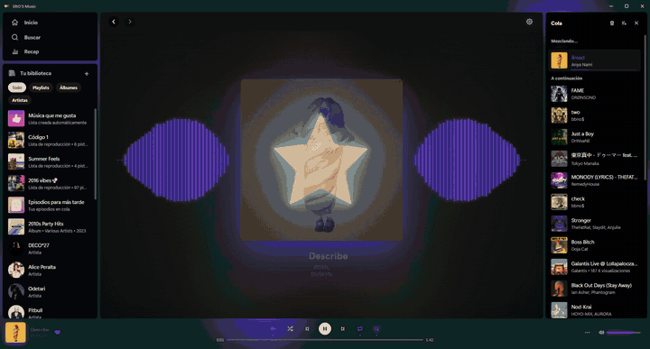
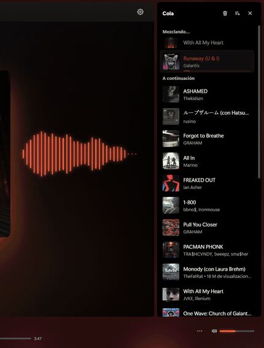
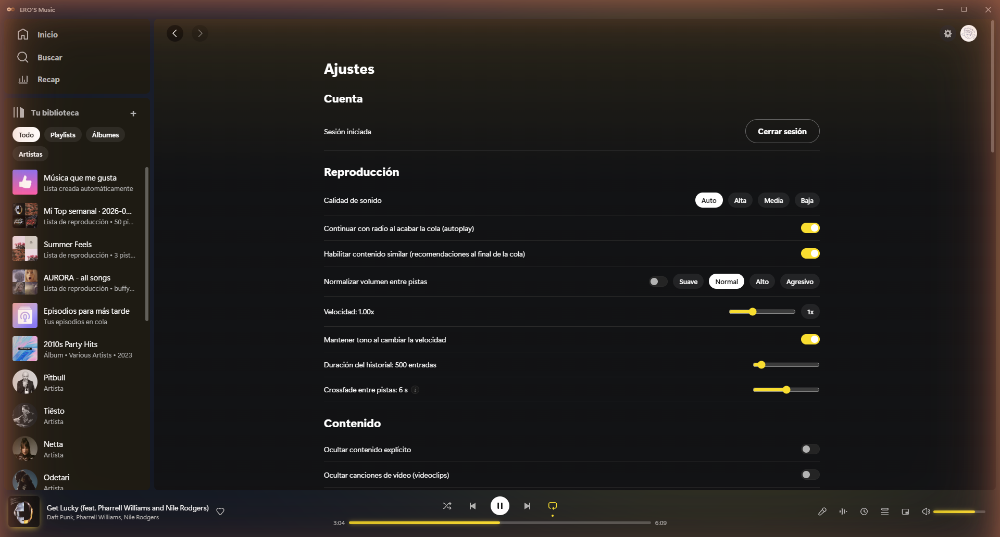
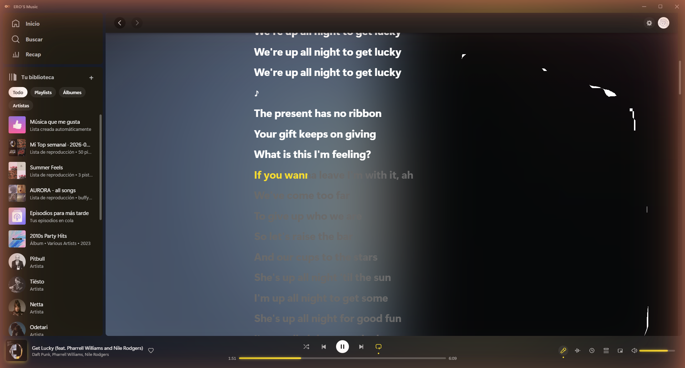
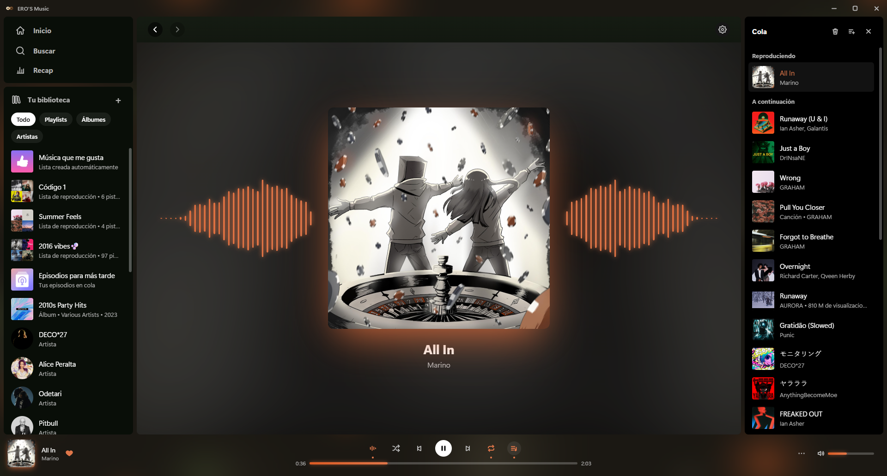
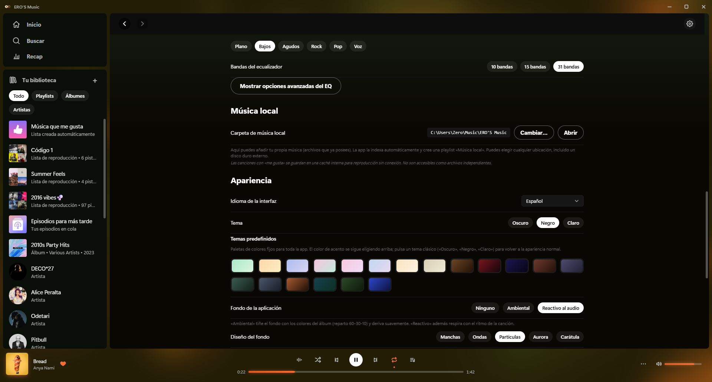
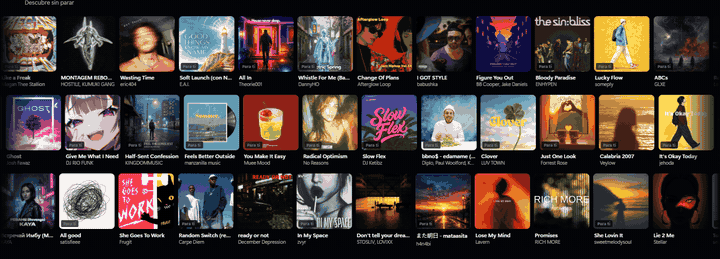

  

<h1 align="center">ERO'S Music</h1>

  An alternative desktop interface for enjoying YouTube Music.

  <strong>English</strong> · <a href="README.es.md">Español</a>

  
  
  

  
  
  
  
  

  

---

## What is it?

ERO'S Music is an unofficial desktop client for **YouTube Music on Windows**, built by Zero as a personal project. It is not a browser wrapper: it has its own audio engine, an interface built from scratch, and it connects to your Google account — your library, your playlists, your likes and your history, exactly as you have them.

## Why ERO'S Music and not something else?

| | YouTube Music (web) | Spotify Desktop | Other YT Music clients | ERO'S Music |
|---|:---:|:---:|:---:|:---:|
| True crossfade between tracks | ❌ | ⚠️ Premium only | ❌ | ✅ |
| 10/15/31-band equalizer | ❌ | ❌ Not on desktop | ❌ | ✅ |
| Import AutoEq equalizer profiles | ❌ | ❌ | ❌ | ✅ |
| Floating mini-player | ❌ | ❌ | ⚠️ Limited | ✅ |
| Reactive ambient background | ❌ | ❌ | ❌ | ✅ |
| Word-by-word karaoke | ❌ | ⚠️ Partial | ❌ | ✅ |
| Fully local statistics | ❌ | ❌ | ❌ | ✅ |
| Last.fm / ListenBrainz | ❌ | ❌ | ⚠️ Last.fm only | ✅ Both |
| Import playlists from any service | ❌ | ❌ | ❌ | ✅ |
| Local music with metadata editing | ❌ | ✅ Partial | ❌ | ✅ |
| Free, no subscription | ✅ | ❌ | ✅ | ✅ |

**Compared to YouTube Music web** — the official site has no crossfade, no EQ, no mini-player, no ambient background, no word-by-word karaoke and no local statistics. ERO'S Music adds all of that on top of that very same account.

**Compared to Spotify Desktop** — Spotify requires a paid subscription for most features, has no real EQ on desktop and no reactive background, and its catalogue is different: there is a lot of music (remixes, live sets, covers, small channels) that only exists on YouTube.

**Compared to other YT Music clients** (th-ch/youtube-music and similar) — those are wrappers: they embed the official website inside Electron and patch it. ERO'S Music has its own dual-deck audio engine, its own lyrics pipeline and a UI built from scratch.

In short:

- 🎧 **Your account, a new interface** — the account is yours, the experience is new.
- 🔊 **A custom audio engine** — true crossfade (two tracks mixed at once), not a fade-out followed by a fade-in.
- 🔒 **Local by default** — your library, your statistics and your history never leave your computer.

## Features

### 🎵 Streaming with your own account
Sign in with Google and everything is there: your library, your playlists, your likes and your history. Whatever you do in the app is reflected in your account and the other way around.

  

### 🎨 Coffee Cream design + 20 themes
The ambient background extracts a 60-30-10 palette from the album artwork and reacts to the audio in real time, with **5 designs to choose from**: Blobs, Waves, Particles, Aurora and Blurred artwork. It includes 20 theme presets on a light, dark or black base, with a dynamic accent colour. The whole interface uses a set of line icons drawn specifically for the app.

  

And since the colour comes from the artwork, the entire app shifts tone as the song changes:

  

### 🔀 True crossfade between tracks
A dual-deck engine: the next song starts playing while the current one is still ending, genuinely mixed together. Configurable from 0 to 12 seconds, with gapless playback on albums.

The queue shows it as it happens: the outgoing song is marked as "Mixing…", an accent bar fills for exactly as long as the fade lasts, and the list reorders itself when it finishes.

  

  

### 🎤 Synced lyrics and karaoke
Lyrics synchronised with the music. The line that is playing lights up in a cascade, letter by letter, while the rest dim and blur according to how far away they are. It reads over any cover art, however bright, and can be centred or left-aligned.

  

### 🎛️ 10, 15 and 31-band equalizer + visualizer
Three equalizer modes (10, 15 and 31 bands) with 6 presets that are automatically interpolated to any mode. Full manual control with preamp. The visualizer displays frequency bars reacting to the audio in real time.

Equalizer files can also be imported from *Settings → Equalizer*: AutoEq and Equalizer APO (`ParametricEQ.txt`), AutoEq and Wavelet (`GraphicEQ.txt`), measurement curves in CSV, and JSON profiles from the mobile app. The bands in the file are translated to the bands of the app equalizer for the 10, 15 and 31 band modes at once. **My equalizers** keeps everything imported, along with anything saved with **Save current settings**.

  

  

### 🌀 Musical Spiral
A discovery section on the main screen with 3 rows of continuously scrolling cards. It suggests music based on your favourite artists, your history and your likes. Songs rotate automatically from a reserve pool so there is always something new.

  

### 🎧 Last.fm scrobbling
Connect your Last.fm account from Settings and your listens are recorded automatically. It sends nowPlaying when each song starts, and a scrobble once you are past 50% or 30 seconds.

### 📡 ListenBrainz sync
A free alternative to Last.fm. Paste your token in Settings and that is it — playing_now and submit-listens, sharing the same trigger as Last.fm.

### 📥 Import playlists from any service
Three routes in *Library → Import playlist*. **Link**: Spotify, Apple Music, Deezer, TIDAL, SoundCloud, Bandcamp, Last.fm and YouTube / YT Music, albums included — the service is recognised as the link is typed. **File**: M3U/M3U8, PLS, XSPF, WPL/ZPL, ASX, CSV/TSV, JSON and TXT, with the format worked out from the contents. **Paste list**: any list of tracks as plain text, which works even with services that publish nothing. Each song is looked up on YouTube Music, the results are shown, and the playlist is created in your account.

### 🖥️ Floating mini-player
Always on top of other windows, snaps to the corners, resizable and with a karaoke mode.

### 📊 Statistics and personal recap
Weekly and monthly tops with a summary of your activity. Everything is computed entirely on your machine: nothing leaves it.

### 🎮 Discord Rich Presence
Shows what you are listening to on Discord. Optional and can be turned off.

### 🔄 Auto-update
You are asked before updating. Nothing is ever downloaded silently.

### 🌐 Spanish and English
The interface is fully translated into both languages.

### 👋 Guided onboarding
A welcome assistant walks you through the app the first time you open it.

### 📮 Reporting problems and suggesting improvements
From **Settings → Help and feedback** you can report bugs or suggest improvements, attaching screenshots or videos to show the problem. A contact can optionally be left in case further details are needed. Reports are read and acted on: the section list in Settings and the Musical Spiral fix, both in v1.5.13, came from this channel.

### 🔗 Sharing playlists
The link to a private playlist does not work for whoever receives it. When sharing your own playlist while it is still private, the application warns and asks for confirmation before making it public. Each playlist shows whether it is public, private or unlisted.

### 🎶 Local music
Add your own audio files (MP3, FLAC, OGG, OPUS, WAV, M4A…) to the library and play them alongside your YouTube Music. Title, artist, album and cover art can be edited straight from the app, and the ambient background adapts to the artwork just like with any other song.

## Privacy

ERO'S Music only connects to what is strictly necessary:

- **YouTube Music** — for streaming and for your account.
- **Lyrics services** — for the synced lyrics.
- **Discord** — only if you enable Rich Presence.
- **Last.fm / ListenBrainz** — only if you connect your account in Settings.

### 🔒 Performance reports (v1.5.7)

Since v1.5.7 the application can send **performance reports**, which makes it possible to detect and fix problems without depending on someone reporting them. The terms, with no small print:

- 🔒 **It never reaches third parties. Nobody.** Reports go solely towards the development of the application. No analytics companies, no advertisers, no tracking services. Nothing is sold, shared or handed over.
- 🔧 **Its only purpose is to improve the application.** Spotting what is slow, freezing or breaking, and fixing it. Nothing else.
- ✅ **It is entirely optional.** The first time the application is opened a window appears explaining it, with the switch right there, and it can be turned on or off at any time from **Settings → Help and feedback**. With sending disabled the application works exactly the same: no feature is lost.

**What the report contains:** how long it takes to start, how much memory and CPU it uses, whether the interface froze, any technical errors that occurred and the Windows version. Nothing else.

**What never leaves your computer:**

- ❌ Your music, your searches and your playlists.
- ❌ Your Google account.
- ❌ Your computer name and your personal folders (they are masked before anything is sent).
- ❌ No third-party analytics, no advertising and no profiling.
- ✅ Statistics live in a local SQLite database, on your machine.

Reports written from **Settings → Help and feedback** follow the same terms: they are sent only when the button is pressed, and contain only what has been written and attached.

## Requirements

- Windows 10/11 (64-bit)
- A Google account
- ~150 MB of disk space
- Per-user installation: **no administrator rights or UAC prompt required**

## Where ERO'S Music is heading

ERO'S Music is a living project with the ambition to go further. The long-term idea is:

- 🔗 **Integrating more platforms** — being able to reach your libraries and playlists across different streaming services from a single place.
- 🧩 **Many more features** — the roadmap is open and grows with every release. This is not a finished product: it is a personal project aiming high.

## Download

  

Download the installer from the [latest release](https://github.com/agm22profesionalmail-dot/eros-music-releases/releases/latest) and run it. If you already have an earlier version installed, the installer detects it and upgrades cleanly without you having to do anything.

> ⚠️ **A note about Windows SmartScreen**
>
> When running the installer, Windows may show a "Windows protected your PC" warning with "Unknown publisher". This happens because the app does not have a paid code-signing certificate — it is a personal, non-profit project.
>
> **It is safe.** To continue, click **"More info"** and then **"Run anyway"**. The source code is public and you can review it yourself.

---

  Made with ☕ by <strong>Zero</strong> · A personal, non-profit project.

  <em>ERO'S Music is an independent, unofficial project. 
  It is not affiliated with, sponsored by or endorsed by Google, YouTube, Spotify, Discord 
  or any other brand mentioned. All product and brand names are the property of their 
  respective owners and are used for descriptive purposes only. 
  Use of this application is at the user's own risk.</em>

